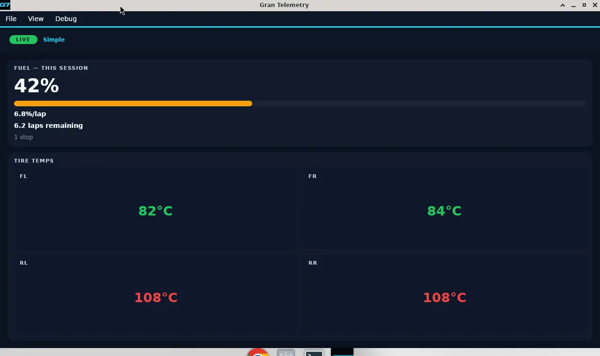
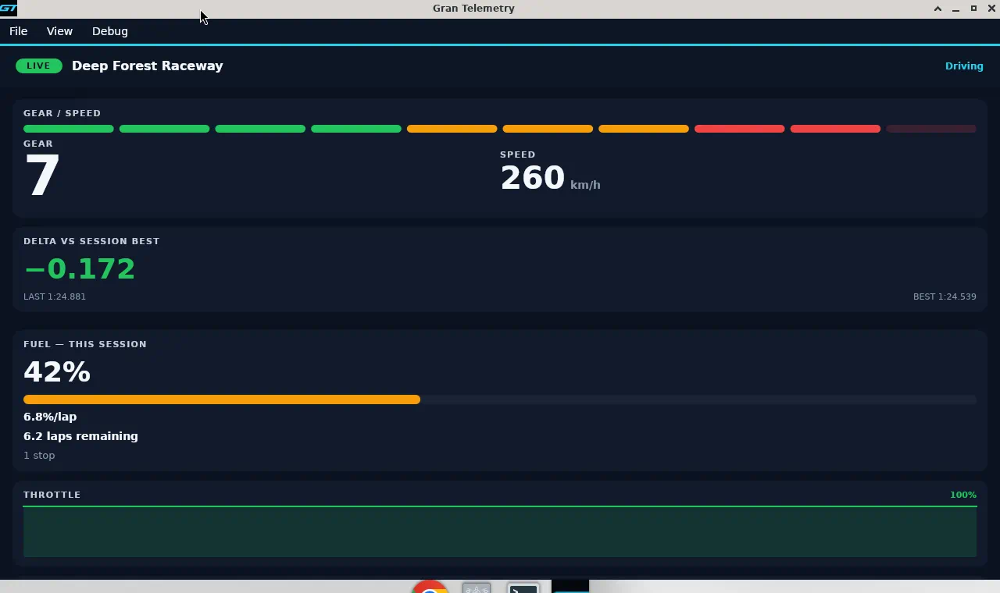
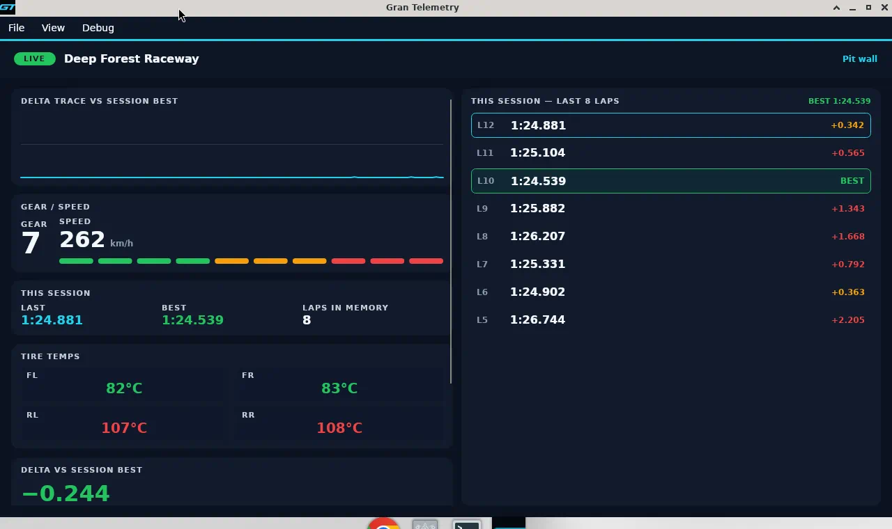

# SlickDash (Windows)

Native **.NET 8 + Avalonia** desktop companion for **Gran Turismo 7** live telemetry (Figma v2).

Not affiliated with Sony Interactive Entertainment or Polyphony Digital.

A single resizable window. **Simple is the default**, including when maximized. Switch views from the **View** menu only (Simple / Driving / Pit wall — no Auto). Last view is persisted in `settings.json`.

| Mode | Layout |
|------|--------|
| **Simple** (default) | HUD-on: tire temps (fills leftover height) + fuel only. No gear, chips, or map. |
| **Driving** | HUD-off replica dash: gear/speed/RPM, delta, throttle/brake traces, tires (fills leftover height), fuel. |
| **Pit wall** | Delta trace + gear/speed (one RPM strip); last/best, tires, last-100 this-session lap table (scrolls in the right pane); delta vs best, fuel. Find PS5 is File-menu only. No map. |

Palette: page `#0B1220`, cards `#111A2B`, cyan `#22D3EE`, green `#22C55E`, red `#EF4444`, amber `#F59E0B`.

## Download

Windows 64-bit, no .NET install. Same self-contained exe we publish locally:

[GranTurismoTelemetry.exe](https://github.com/robFraser1111/gran-turismo-telemetry-windows/releases/latest/download/GranTurismoTelemetry.exe)

Tag `v0.9.1` (or `0.9.1`) and push, or run the **release** Action by hand, and that file updates.

## Screenshots

Refresh `docs/screenshots/` whenever a view's design or layout changes, then update this section if the filenames change.

Simulated session so the panes have data. Swap in a live Simple + HUD shot when we have one.

### Simple



### Driving



### Pit wall




Avalonia is used so this project **builds on Linux** as well as Windows. WinUI 3 cannot compile here.

## Build / run / publish

Requires the [.NET 8 SDK](https://dotnet.microsoft.com/download/dotnet/8.0).

```bash
dotnet build
dotnet run --project src/GranTurismoTelemetry
dotnet test
```

Publish a self-contained Windows exe (run this on any SDK host; the output runs on 64-bit Windows):

```bash
dotnet publish src/GranTurismoTelemetry -c Release -r win-x64 --self-contained true -p:PublishSingleFile=true -p:IncludeNativeLibrariesForSelfExtract=true
```

The exe lands in `src/GranTurismoTelemetry/bin/Release/net8.0/win-x64/publish/GranTurismoTelemetry.exe`.

If `dotnet` is missing, install the SDK then retry:

```bash
# Linux / WSL
curl -fsSL https://dot.net/v1/dotnet-install.sh | bash -s -- --channel 8.0
export PATH="$HOME/.dotnet:$PATH"
```

## Simulator telemetry

The app starts idle. Turn on **Debug → Open debug → Simulator telemetry** for fake packets at ~60 Hz (UI ~30 Hz). No PS5 required. Simulator stays on until you **Find PS5** or **Connect** (File menu).

## Live against a PS5

1. PS5 and PC on the **same LAN**.
2. Launch GT7 and sit in a car (garage / menus do not stream).
3. Launch the app — it searches the LAN for GT7 automatically. **File → Find PS5** searches again; **Connect to IP** if broadcast misses.
4. Allow inbound UDP **33740** through Windows Firewall if prompted.

Protocol:

- Heartbeat: one ASCII byte `A` from the same socket to PS5 port **33739** every ~2 s.
- Listen UDP **33740**, IPv4 `IPAddress.Any`, one receive at a time.
- Windows applies `SIO_UDP_CONNRESET` so a missing PS5 does not kill the receive loop.
- If UDP 33740 is already bound: the UI tells you to close the original web app.

Status: amber = waiting, green = Connected + IP. Packet counters (`rx` / `dec` / `err`) and the quality bar live on the **Connect** panel only — never on the HUD.

## Live this-session only

Shown: tire temps (no wear); fuel % remaining, %/lap, laps remaining, predicted stops; gear/speed/shift (Driving + Pit wall); delta vs this-session best, last/best; throttle/brake traces (Driving); this-session last-100 lap table (Pit wall, scrolls when the pane is full).

Not shown: track map, past-session history UI, audio/TTS, TCS/ASM on the driving HUD, packet counters on the HUD, WINDOW OPEN badge, on-canvas mode chips, session notes. No fake Custom Pro lock.

## Protocol

Implemented in C# (Salsa20 20 rounds + 296-byte packet parse), matching
https://github.com/robFraser1111/gran-turismo-telemetry :

- Key: first 32 bytes of UTF-8 `"Simulator Interface Packet GT7 ver 0.0"`.
- Nonce: ciphertext bytes `0x40..0x44` as LE `uint32`, XOR `0xDEADBEAF` for the first 4 nonce bytes; original 4 bytes are the second half.
- After decrypt, magic at offset 0 must be `"G7S0"` (`0x47375330`). Drop otherwise.

## Project layout

```
src/GranTurismoTelemetry/
  Theme/              palette
  Gt7/                Salsa20, packet, UDP, simulator, service, session
  Controls/           traces, RPM strip, fuel bar
  Views/              Simple + Driving (side monitor) + Pit wall + connect + debug
  ViewModels/         MainViewModel (HudMode)
tests/GranTurismoTelemetry.Tests/
```
